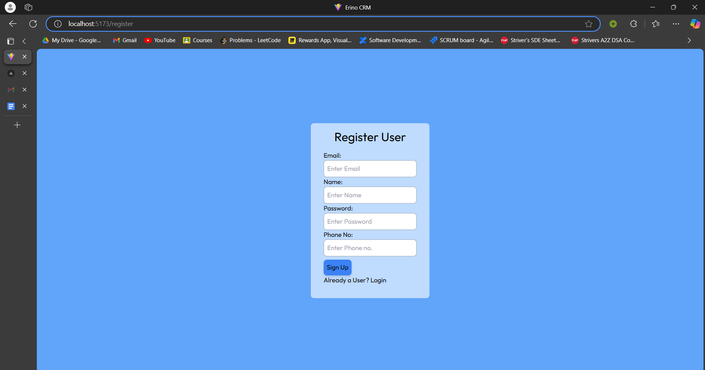
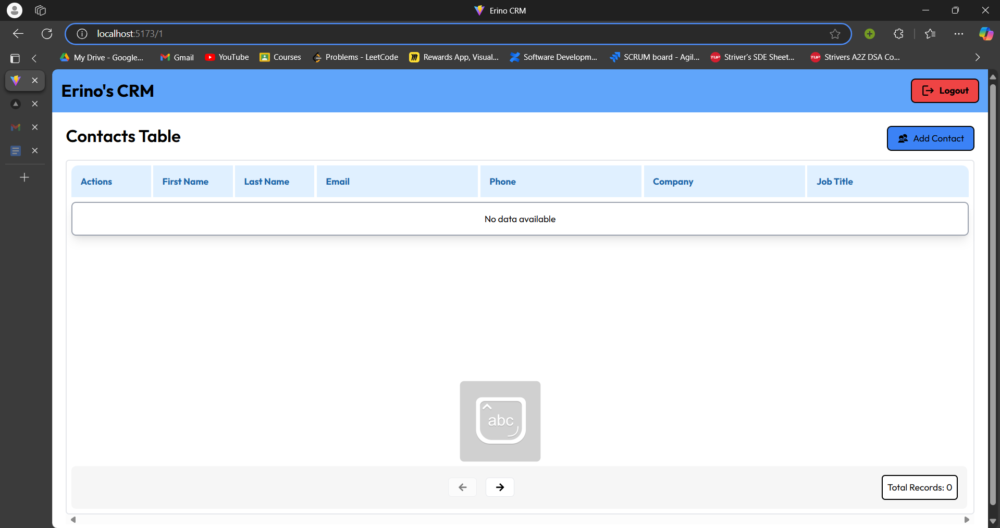
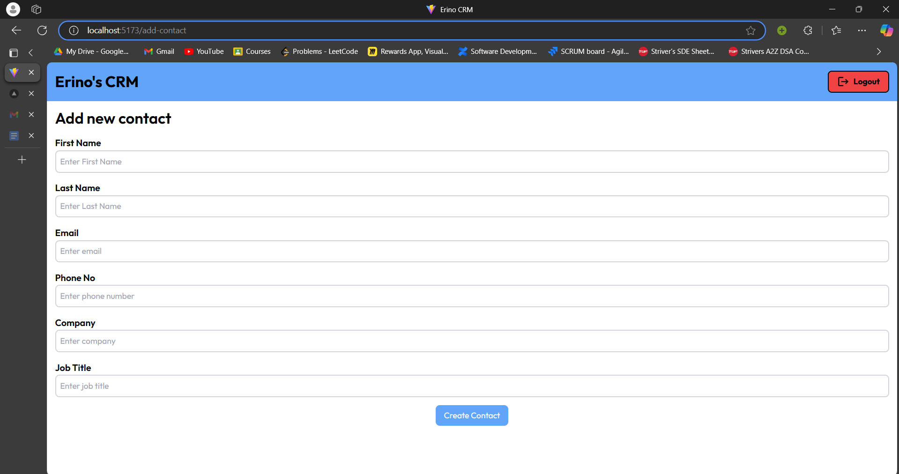
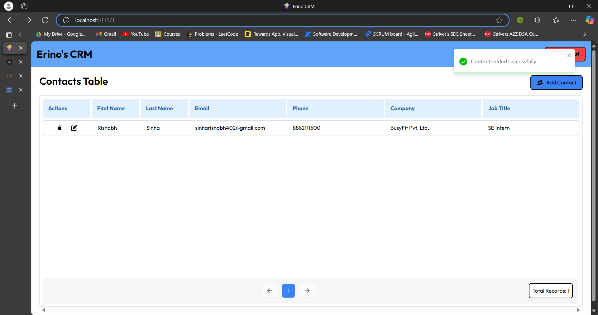

# Erino's CRM

## Github link (https://github.com/Rishabh324/Erino_CRM)

### Description

A modern web application that lets users add, view, update, and delete contact details all in one place. This makes it easy for users to find and manage information, which is especially helpful in a business setting where keeping track of relationships is key.

### Key Features:

1. User Authentication: Secure login and signup system to manage access.
2. Contact Addition: User can add a contact to their list of personalized contacts.
3. Personalized Contact List:
    i. Users can view a list of all contacts they have added.
    ii. Each user has access to only their own entries, ensuring privacy and security.
4. Detailed Contact View: Users can click on a contact to see its full details.
5. Contact Editing: Modify contact details, including title, description, tags, or images, at any time.
6. Contact Deletion: Remove any contact entry securely from the collection.

The application is built using a Node.js backend with MongoDB for data storage and React for the frontend, making it responsive and capable of handling real-time updates to contact items.

The reason for choosing Mongodb is that because:

1. It is a NoSQL database that means it offers a flexible, schemaless design.
2. CRM application often needs to handle diverse and varying data, and for that we need to handle semi-structured or unstructured data.
3. MongoDB is built for horizontal scalability, which would be very useful in case of large number of users.
4. The appliction here does not requires the use of complex JOIN queries.
5. It naturally supports JSON data format useful for RESTAPIs

### Installation

Step-1: Clone the github repository by running following command in terminal.
```
git clone https://github.com/Rishabh324/Erino_CRM
```

Step-2: Now setup the frontend by adding a .env file with the following content in your client folder.
```
VITE_REACT_APP_BASEURL=http://localhost:5000/api
```

Step-3 Now run the following command on terminal in your client folder.
```
npm install
```

Your frontend is setup successfully and you can run it by using the following command.
```
npm run dev
``` 

Step-4: Now setup the backend by adding a .env file with the following content in your server folder.
```
DEV_MODE="development"
PORT=5000
DATABASE_PASSWORD=""
DATABASE=""
JWT_SECRET = "CONTACTCRM"
```

Now go to https://www.mongodb.com/ and create an account. Once account is created, you can create a database and a cluster inside the database. Then replace the DATABASE, DATABASE_PASSWORD, with the credentials of database you just created.

Step-5 Now run the following command on terminal in you server folder.
```
npm install
```

Your backend is setup successfully and you can run it by using the following command.
```
npm run server
``` 

### Deployment

#### Note - Since the backend is deployed on render and due to limitations of free account it may take upto 50 seconds of time to successfully process the first request. On the subsequent request, it will be as good as normal. 

The frontend is deployed on vercel. Here is the deployed link to frontend.

Frontend - 

The backend is deployed on render. 

### Database Schema

The database consists of two schema:
    
    i. userSchema
    ii. contactSchema

The userSchema is:
```
const userSchema = new mongoose.Schema({
    email: {
        type: String,
        required: [true, "email is required"],
    },
    name: {
        type: String,
        required: [true, "name is required"],
    },
    phone: {
        type: Number,
        required: [true, "phone is required"],
    },
    password: {
        type: String,
        required: [true, "A password must be there."],
    },
}, { timestamps: true });
```

The contactSchema is:
```
const contactsSchema = new mongoose.Schema({
    firstName: {
        type: String,
        required: [true, "first name is required"],
    },
    lastName: {
        type: String,
        required: [true, "last name is required"],
    },
    email: {
        type: String,
        required: [true, "email is required"],
    },
    phone: {
        type: Number,
        required: [true, "phone is required"],
    },
    company: {
        type: String,
        required: [true, "company is required"],
    },
    jobTitle: {
        type: String,
        required: [true, "job title message is required"],
    },
    createdBy: {
        type: String,
        required: true,
    },
}, { timestamps: true });
```

### Working

Step-1: Create a user by filling and submitting the form on register page.


Step-2: Now login with those credentials.

Step-3: Once you login you will see ans empty table.


Step-4: Go ahead and create new contacts by clicking on 'add contact' button on top right of the section. Once you click the button. It will take you to a form.


Step-5: Fill the details in the form with the details of the contact you want to add and press submit. The contact will be created.


If you want to edit a contact click on the pencil icon next to that contact in the action column. It will take you to an edit form. Correct the details and press submit button. The edit form is similar to the add contact form.

If you want to delete a contact then click on the bin icon next to that contact in the action column. The contact will be deleted.

Once you are done using the portal, you can logout by clicking the 'logout' button on the top right corner of window.